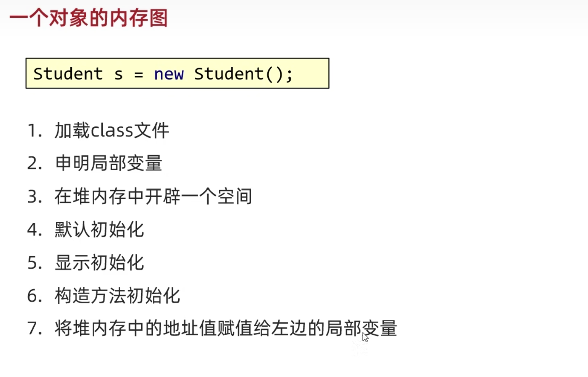

# JAVA NOTES（Part 13）==by tasike==

# 面向对象

- ## 设计对象并使用

- ## 封装

- ## this关键字

- ## 构造方法

- ## 标准JavaBean

- ## 对象内存图

- ## 成员变量与局部变量的区别

-----------

## 1 设计对象并使用

- ### 类和对象：

  - 类：是对象共同特征的描述
  - 对象：是真实存在的具体东西

==在Java中，必须先设计对象，然后再获取对象==

```java
比如，先设计一个Phone的类：
public class Phone{
    ......;
}

然后，通过new关键词来获取对象
Phone p1 = new Phone(); //获得一个Phone的对象
Phone p2 = new Phone(); //再获得另一个Phone的对象
```

- ### 如何定义类

```java
public class 类名{
    1.成员变量（代表属性，一般是名词）
    2.成员方法（代表行为，一般是动词）
    3.构造器（后面会学）
    4.代码块（后面会学）
    5.内部类（后面会学）
}
```

案例：
```java
public class Phone{
    //属性（成员变量）（只定义，不给值）
    String brand;
    double price;
    
    //行为（成员方法）（比如手机可以打电话，玩游戏等）
    public void call(){
        
    }
    public void playGames(){
        
    }
}
```

+ ### 如何得到类的对象

```java
类名 对象名 = new 类名();
```

案例：
```java
Phone p = new Phone();
```

- ### 如何适用对象

```java
访问属性：
    对象名.成员变量
访问行为：
    对象名.方法名(...)
```

- ### 定义类的注意事项

  - 用来描述一类事物的类，专业叫做==JavaBean类==
    在JavaBean类中，是不写main方法的
  - 编写main方法的类，叫做==测试类==
    我们可以在测试类中创建JavaBean类的对象并进行赋值调用
  - 一个代码文件可以定义多个类，但是只能有一个类是public修饰的，public修饰的类名必须是java代码文件的文件名称。
  - 成员变量的完整定义格式为：修饰符 数据类型 变量名称 = 初始化值；一般无需指定初始化值，存在默认值

---------------------

## 2 封装

举个例子：人画圆，针对这个需求进行面向对象设计。
				对于人这个类和圆这个类，画圆这个行为应该写在哪个类里面呢？
				事实上，应该要写在圆这个类中。

举另一个例子：人关门，也是把关门这个行为写在门这个类当中。

**private关键词：**

- 权限修饰符
- 可以修饰成员变量和成员方法
- 被private修饰的变量只能在本类中才能访问，也就是可以防止外界访问。

```java
public class GirlFriend {
    private int age;
    
    public void setAge(int setNum){
        if(setNum >= 16 && setNum <= 28){
            age = setNum;
        }else{
            System.out.println("非法数据");
        }
    }
    
    public int getAge(){
        return age;
    }
}
```

-------------------

## 3 this关键字

- ==成员变量和局部变量：成员变量在类里面，方法外面；局部变量在方法里面==

- 就近原则

如果有一个成员变量和一个局部变量重名，那么再次使用变量的时候采取的是就近原则
```java
public class GirlFriend{
    private int age;
    public void method(){
        int age = 10;
        System.out.println(age); //这个打印语句离局部变量近，所以输出局部变量age(10)
    }
}
```

而我们若想要用成员变量，那么可以使用this关键字
```java
public class GirlFriend{
    private int age;
    public void method(){
        int age = 10;
        System.out.println(this.age); //这时候输出成员变量age(0)
    }
}
```

**那么对于  2 封装   中的代码就可以改写：**

```java
public class GirlFriend {
    private int age;
    
    public void setAge(int age){  //把参数位置的变量也写成age，不用再多写一些名字
        if(age >= 16 && age <= 28){
            this.age = age;    //这里利用this把局部变量的值赋给同名的成员变量
        }else{
            System.out.println("非法数据");
        }
    }
    
    public int getAge(){
        return age;
    }
}
```

--------------

## 4 构造方法

- 作用：在创建对象的时候给成员变量进行赋值

- 格式：
  ```java
  修饰符 类名(参数){
      方法体;
  }
  ```

- 特点：

  - 方法名与类名相同，大小写也要一致
  - 没有返回值类型，连void都没有
  - 没有具体的返回值（不能由return带回结果数据）

- 执行时机：

  - 创建对象的时候由虚拟机调用，不能手动调用构造方法
  - 每创建一次对象，就会调用一次构造方法

- 分类：

  - 空参构造
  - 带参构造

- 带参构造可以省的我们写set来设置成员变量的值

- 如果没有定义构造方法，那么系统会给出一个默认的空参构造方法；如果定义了构造方法，那么系统将不再提供默认的空参构造方法。

- 构造方法的重载：带参构造方法和空参构造方法，方法名相同，参数不同，这叫做构造方法的重载

- 推荐的使用方式：==无论是否使用，都手动书写空参构造方法和带全部参数的构造方法==

------------

## 5 标准JavaBean

- ### 类名需要见名知意

- ### 成员变量使用private修饰

- ### 提供至少两个构造方法

  - #### 空参构造方法

  - #### 带全部参数的构造方法

- ### 成员方法

  - #### 提供每一个成员变量对应的setXxx()/getXxx()

  - #### 如果还有其他行为，也需要加上

==演示：==

```java
public class UserSystem {
    private String userName;
    private String passWord;
    private String isPassWord;
    private String userEmail;
    private String userGender;
    private int userAge;

    public UserSystem(){}
    public UserSystem(String userName, String passWord, String isPassWord, String userEmail, String userGender, int userAge){
        this.userName = userName;
        this.passWord = passWord;
        this.isPassWord = isPassWord;
        this.userEmail = userEmail;
        this.userGender = userGender;
        this.userAge = userAge;
    }

    public void setUserName(String userName){
        this.userName = userName;
    }
    public String getUserName(){
        return this.userName;
    }
    public void setPassWord(String passWord){
        this.passWord = passWord;
    }
    public String getPassWord(){
        return this.passWord;
    }
    public void setIsPassWord(String isPassWord){
        if(!this.passWord.equals(isPassWord)){
            System.out.println("确认密码失败，请重新确认密码：");
        }
    }
    public String getIsPassWord(){
        return this.isPassWord;
    }
    public void setUserEmail(String userEmail){
        this.userEmail = userEmail;
    }
    public String getUserEmail(){
        return this.userEmail;
    }
    public void setUserGender(String userGender){
        this.userGender = userGender;
    }
    public String getUserGender(){
        return this.userGender;
    }
    public void setUserAge(int userAge){
        this.userAge = userAge;
    }
    public int getUserAge(){
        return this.userAge;
    }
}
```

==事实上，在vscode中有快捷键来代替这些繁杂的工作：==

- ==鼠标右键-源代码操作-GenerateConstructors-确认==可以得到空参构造方法
- ==鼠标右键-源代码操作-GenerateConstructors-全选-确认==可以得到全参构造方法
- ==鼠标右键-源代码操作-Generate Getters and Setters-全选-确认==可以得到所有的getXxx和setXxx

-----------------

## 6 对象内存图


- ### 一个对象的内存图




**全部执行完后，study方法先出栈，然后main方法出栈，mian方法里的变量s就会销毁，那么指向堆内存的地址也没有了，由于没有东西指向该对象的堆内存地址，因此堆内存里的对象也会销毁。**

- ### 多个对象的内存图

**和上面的类似，只是在堆内存里开辟了两个空间，方法区的字节码文件不用再加载一次**

- ### 两个变量指向同一个对象内存图


**当stu1和stu2都是null的时候，就没有东西指向对象的堆内存地址，那么堆内存中的对象就会被销毁，然后main方法出栈**


- ### this的内存原理


- ### 成员变量与局部变量的区别

  - 成员变量：类中方法外的变量

  - 局部变量：方法中的变量

  - 区别：

    |     区别     |                  成员变量                  |                    局部变量                    |
    | :----------: | :----------------------------------------: | :--------------------------------------------: |
    | 类中位置不同 |                类中，方法外                |                方法内，形参位置                |
    | 初始化值不同 |               有默认初始化值               |           没有，使用之前需要完成赋值           |
    | 内存位置不同 |                   堆内存                   |                     栈内存                     |
    | 生命周期不同 | 随着对象的创建而存在，随着对象的消失而消失 | 随着方法的调用而存在，随着方法的执行结束而消失 |
    |  作用域不同  |                整个类中有效                |                 当前方法中有效                 |

    


