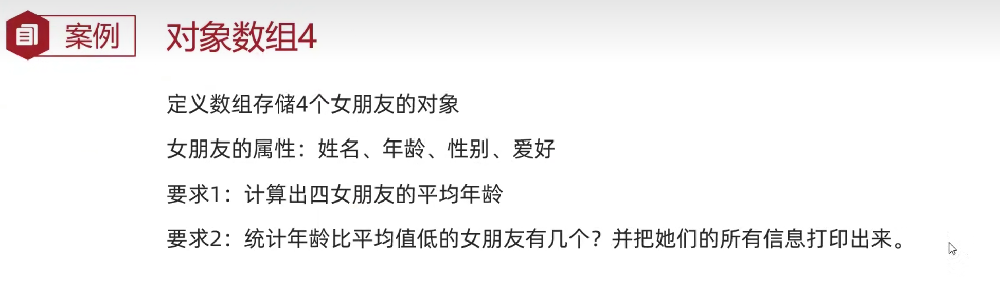

# JAVA NOTES（Part 14）==by tasike==

# 面向对象综合练习

练习1：

```java
import java.util.Random;

public class Role {
    private String name;
    private int bloodVolume;
    private char gender;
    private String face;
    String[] boyFace = {"风流倜傥","气宇轩昂","英俊潇洒","五官端正"};
    String[] girlFace = {"英姿飒爽","美轮美奂","沉鱼落雁","亭亭玉立"};
    
    //攻击描述
    String[] attacks_desc = {
        "%s使出了一招[背心刺]，转到对方的身后，一掌向%s背心的灵台穴刺去。",
        "%s使出了一招[游空探爪]，飞起身形自半空中变掌为爪锁向%s。",
        "%s大喝一声，身形下伏，一招[霹雷坠地]，捶向%s双腿。",
        "%s运气于掌，一瞬间掌心变得血红，一式[掌心雷]，推向%s。",
        "%s阴手翻起阳手跟进，一招[没遮拦]，结结实实地捶向%s。",
        "%s上步抢身，招中套招，一招[劈挂连环]，连环攻向%s。"
    };
    
    //受伤描述
    String[] injures_desc = {
        "结果%s退了半步，毫发无损。",
        "结果给%s造成一处瘀伤。",
        "结果一击命中，%s痛得弯下腰。",
        "结果%s痛苦地闷哼一声，显然受了点内伤。",
        "结果%s摇摇晃晃，一跤摔倒在地。",
        "结果%s脸色一下变得惨白，连退了好几步。",
        "结果\"轰\"的一声，%s口中鲜血狂喷而出。",
        "结果%s一声惨叫，像一滩软泥般瘫了下去。"
    };

    public Role() {
    }
    public Role(String name, int bloodVolume, char gender) {
        this.name = name;
        this.bloodVolume = bloodVolume;
        this.gender = gender;
        setFace(gender);
    }


    public String getName() {
        return name;
    }
    public void setName(String name) {
        this.name = name;
    }
    public int getBloodVolume() {
        return bloodVolume;
    }
    public void setBloodVolume(int bloodVolume) {
        this.bloodVolume = bloodVolume;
    }
    public char getGender() {
        return gender;
    }
    public void setGender(char gender) {
        this.gender = gender;
    }
    public String getFace() {
        return face;
    }
    public void setFace(char gender) {
        Random r = new Random();
        if(gender == '男'){
            int indexOfBoy = r.nextInt(boyFace.length);
            this.face = boyFace[indexOfBoy];
        }else{
            int indexOfGirl = r.nextInt(girlFace.length);
            this.face = girlFace[indexOfGirl];
        }
    }

    //方法调用者去攻击参数
    public void attack(Role role){
        Random r = new Random();

        //随机攻击语句
        int indexOfAttack = r.nextInt(attacks_desc.length);
        System.out.printf(attacks_desc[indexOfAttack], this.name, role.name);  //输完前面的字符串位置后，按Tab键可以继续输入下一个位置
        System.out.println();
        
        
        //随机伤害和血量状态
        int attackVolume = r.nextInt(1,21);
        int remainBlood = role.bloodVolume - attackVolume;
        remainBlood = remainBlood < 0 ? 0 : remainBlood;
        role.setBloodVolume(remainBlood);
        System.out.printf("%s对%s造成了%d点伤害，%s还剩下%d点血量\n",this.name,role.name,attackVolume,role.name,remainBlood);


        //被攻击者受伤状况
        if(remainBlood >= 90){
            System.out.printf(injures_desc[0], role.name);
        }else if(remainBlood >= 80 && remainBlood < 90){
            System.out.printf(injures_desc[1], role.name);
        }else if(remainBlood >= 60 && remainBlood < 80){
            System.out.printf(injures_desc[2], role.name);
        }else if(remainBlood >= 40 && remainBlood < 60){
            System.out.printf(injures_desc[3], role.name);
        }else if(remainBlood >= 30 && remainBlood < 40){
            System.out.printf(injures_desc[4], role.name);
        }else if(remainBlood >= 20 && remainBlood < 30){
            System.out.printf(injures_desc[5], role.name);
        }else if(remainBlood > 0 && remainBlood < 20){
            System.out.printf(injures_desc[6], role.name);
        }else{
            System.out.printf(injures_desc[7], role.name);
        }
        System.out.println();
        System.out.println("----------------------------------------");
    }
}
```

```java
public class RoleTest {
    public static void main(String[] args) {
        Role r1 = new Role("澜", 100,'男');
        Role r2 = new Role("镜", 100,'女');
        while(true){
            r1.attack(r2);
            if(r2.getBloodVolume() == 0){
                System.out.println(r1.getName() + " K.O 了" + r2.getName());
                break;
            }
            r2.attack(r1);
            if(r1.getBloodVolume() == 0){
                System.out.println(r2.getName() + " K.O 了" + r1.getName());
                break;
            }
        }
    }
}
```

```
输出结果为：
澜使出了一招[背心刺]，转到对方的身后，一掌向镜背心的灵台穴刺去。
澜对镜造成了7点伤害，镜还剩下93点血量
结果镜退了半步，毫发无损。
----------------------------------------
镜运气于掌，一瞬间掌心变得血红，一式[掌心雷]，推向澜。
镜对澜造成了1点伤害，澜还剩下99点血量
结果澜退了半步，毫发无损。
----------------------------------------
澜运气于掌，一瞬间掌心变得血红，一式[掌心雷]，推向镜。
澜对镜造成了20点伤害，镜还剩下73点血量
结果一击命中，镜痛得弯下腰。
----------------------------------------
镜使出了一招[游空探爪]，飞起身形自半空中变掌为爪锁向澜。
镜对澜造成了9点伤害，澜还剩下90点血量
结果澜退了半步，毫发无损。
----------------------------------------
澜使出了一招[背心刺]，转到对方的身后，一掌向镜背心的灵台穴刺去。
澜对镜造成了20点伤害，镜还剩下53点血量
结果镜痛苦地闷哼一声，显然受了点内伤。
----------------------------------------
镜使出了一招[游空探爪]，飞起身形自半空中变掌为爪锁向澜。
镜对澜造成了5点伤害，澜还剩下85点血量
结果给澜造成一处瘀伤。
----------------------------------------
澜大喝一声，身形下伏，一招[霹雷坠地]，捶向镜双腿。
澜对镜造成了17点伤害，镜还剩下36点血量
结果镜摇摇晃晃，一跤摔倒在地。
----------------------------------------
镜运气于掌，一瞬间掌心变得血红，一式[掌心雷]，推向澜。
镜对澜造成了11点伤害，澜还剩下74点血量
结果一击命中，澜痛得弯下腰。
----------------------------------------
澜大喝一声，身形下伏，一招[霹雷坠地]，捶向镜双腿。
澜对镜造成了8点伤害，镜还剩下28点血量
结果镜脸色一下变得惨白，连退了好几步。
----------------------------------------
镜运气于掌，一瞬间掌心变得血红，一式[掌心雷]，推向澜。
镜对澜造成了6点伤害，澜还剩下68点血量
结果一击命中，澜痛得弯下腰。
----------------------------------------
澜使出了一招[游空探爪]，飞起身形自半空中变掌为爪锁向镜。
澜对镜造成了16点伤害，镜还剩下12点血量
结果"轰"的一声，镜口中鲜血狂喷而出。
----------------------------------------
镜使出了一招[游空探爪]，飞起身形自半空中变掌为爪锁向澜。
镜对澜造成了6点伤害，澜还剩下62点血量
结果一击命中，澜痛得弯下腰。
----------------------------------------
澜使出了一招[背心刺]，转到对方的身后，一掌向镜背心的灵台穴刺去。
澜对镜造成了11点伤害，镜还剩下1点血量
结果"轰"的一声，镜口中鲜血狂喷而出。
----------------------------------------
镜上步抢身，招中套招，一招[劈挂连环]，连环攻向澜。
镜对澜造成了17点伤害，澜还剩下45点血量
结果澜痛苦地闷哼一声，显然受了点内伤。
----------------------------------------
澜使出了一招[游空探爪]，飞起身形自半空中变掌为爪锁向镜。
澜对镜造成了13点伤害，镜还剩下0点血量
结果镜一声惨叫，像一滩软泥般瘫了下去。
----------------------------------------
澜 K.O 了镜
```

------------------

练习2：


```java
public class Goods {
    private String id;
    private String name;
    private double price;
    private int count;
    
    public Goods() {
    }
    public Goods(String id, String name, double price, int count) {
        this.id = id;
        this.name = name;
        this.price = price;
        this.count = count;
    }
    
    public String getId() {
        return id;
    }
    public void setId(String id) {
        this.id = id;
    }
    public String getName() {
        return name;
    }
    public void setName(String name) {
        this.name = name;
    }
    public double getPrice() {
        return price;
    }
    public void setPrice(double price) {
        this.price = price;
    }
    public int getCount() {
        return count;
    }
    public void setCount(int count) {
        this.count = count;
    }
}
```

```java
public class GoodsTest {
    public static void main(String[] args) {
        Goods[] arr = new Goods[3];
        Goods g1 = new Goods("001", "HUAWEI", 4999.2, 500);
        Goods g2 = new Goods("002", "OPPO", 7888.5, 250);
        Goods g3 = new Goods("003", "MI", 2999.55, 350);
        arr[0] = g1;
        arr[1] = g2;
        arr[2] = g3;
        for (int i = 0; i < arr.length; i++) {
            Goods goods = arr[i];
            System.out.println(goods.getId() + ", " + goods.getName() + ", " + goods.getPrice() + ", " + goods.getCount());
        }
    }
}
```

---------------------

练习3：


```java
public class Cars {
    private String brand;
    private double price;
    private String color;
    public Cars() {
    }
    public Cars(String brand, double price, String color) {
        this.brand = brand;
        this.price = price;
        this.color = color;
    }
    public String getBrand() {
        return brand;
    }
    public void setBrand(String brand) {
        this.brand = brand;
    }
    public double getPrice() {
        return price;
    }
    public void setPrice(double price) {
        this.price = price;
    }
    public String getColor() {
        return color;
    }
    public void setColor(String color) {
        this.color = color;
    }
}
```

```java
import java.util.Scanner;

public class CarsTest {
    public static void main(String[] args) {
        Cars[] arr = new Cars[3];
        Scanner sc = new Scanner(System.in);
        for (int i = 0; i < arr.length; i++) {
            Cars c = new Cars();
            System.out.printf("请输入第%d辆汽车的品牌：",i+1);
            String s1 = sc.next();
            c.setBrand(s1);
            System.out.printf("请输入第%d辆汽车的价格：",i+1);
            double d = sc.nextDouble();
            c.setPrice(d);
            System.out.printf("请输入第%d辆汽车的颜色：",i+1);
            String s2 = sc.next();
            c.setColor(s2);
            arr[i] = c;
        }
        for (int i = 0; i < arr.length; i++) {
            System.out.println(arr[i].getBrand() + "\t" + arr[i].getPrice() + "\t" + arr[i].getColor());
        }
    }
}
```

--------------------

练习4：


```java
public class Phone {
    private String brand;
    private double price;
    private String color;
    public Phone() {
    }
    public Phone(String brand, double price, String color) {
        this.brand = brand;
        this.price = price;
        this.color = color;
    }
    public String getBrand() {
        return brand;
    }
    public void setBrand(String brand) {
        this.brand = brand;
    }
    public double getPrice() {
        return price;
    }
    public void setPrice(double price) {
        this.price = price;
    }
    public String getColor() {
        return color;
    }
    public void setColor(String color) {
        this.color = color;
    }
}
```

```java
import java.util.Scanner;

public class PhoneTest {
    public static void main(String[] args) {
        Phone[] arr = new Phone[3];
        Scanner sc = new Scanner(System.in);
        for (int i = 0; i < arr.length; i++) {
            Phone p = new Phone();
            System.out.println("请输入第" + (i+1) + "部手机的品牌：");
            String brand = sc.next();
            p.setBrand(brand);
            System.out.println("请输入第" + (i+1) + "部手机的价格：");
            double price = sc.nextDouble();
            p.setPrice(price);
            System.out.println("请输入第" + (i+1) + "部手机的颜色：");
            String color = sc.next();
            p.setColor(color);
            arr[i] = p;
        }
        double sum = 0;
        for (int i = 0; i < arr.length; i++) {
            sum += arr[i].getPrice();
        }
        double average = sum / arr.length;
        System.out.println(average);
    }
}
```

---------------

练习5：



```java
public class GirlFriend {
    private String name;
    private int age;
    private String gender;
    private String hobby;
    public GirlFriend() {
    }
    public GirlFriend(String name, int age, String gender, String hobby) {
        this.name = name;
        this.age = age;
        this.gender = gender;
        this.hobby = hobby;
    }
    public String getName() {
        return name;
    }
    public void setName(String name) {
        this.name = name;
    }
    public int getAge() {
        return age;
    }
    public void setAge(int age) {
        this.age = age;
    }
    public String getGender() {
        return gender;
    }
    public void setGender(String gender) {
        this.gender = gender;
    }
    public String getHobby() {
        return hobby;
    }
    public void setHobby(String hobby) {
        this.hobby = hobby;
    }
}
```

```java
import java.util.Scanner;

public class GirlFriendTest {
    public static void main(String[] args) {
        GirlFriend[] arr = new GirlFriend[4];
        Scanner sc = new Scanner(System.in);
        for (int i = 0; i < arr.length; i++) {
            GirlFriend gf = new GirlFriend();
            System.out.println("请输入第" + (i+1) + "个女友的姓名：");
            String name = sc.next();
            gf.setName(name);
            System.out.println("请输入第" + (i+1) + "个女友的年龄：");
            int age = sc.nextInt();
            gf.setAge(age);
            System.out.println("请输入第" + (i+1) + "个女友的性别：");
            String gender = sc.next();
            gf.setGender(gender);
            System.out.println("请输入第" + (i+1) + "个女友的爱好：");
            String hobby = sc.next();
            gf.setHobby(hobby);
            arr[i] = gf;
        }
        int ageSum = 0;
        for (int j = 0; j < arr.length; j++) {
            ageSum += arr[j].getAge();
        }
        double ageAverage = ageSum * 1.0 / arr.length;
        System.out.println("四个女友的平均年龄是：" + ageAverage);

        int[] flag = new int[4];
        int num = 0;
        for (int k = 0; k < arr.length; k++) {
            if(arr[k].getAge() < ageAverage){
                flag[k] = 1;
                num++;
            }else{
                flag[k] = 0;
            }
        }
        System.out.println("四个女友中年龄比平均值低的有" + num + "个");
        System.out.println("她们的信息分别为：");
        for (int i = 0; i < arr.length; i++) {
            if(flag[i] == 1){
                System.out.println(arr[i].getName() + "\t" + arr[i].getAge() + "\t" + arr[i].getGender() + "\t" + arr[i].getHobby());
            }
        }
    }
}
```
