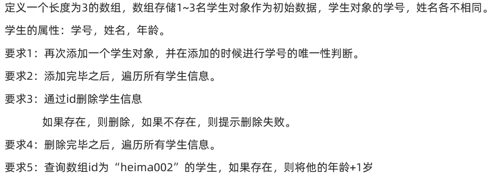

# JAVA NOTES（Part 14）==by tasike==

# 面向对象综合练习（复杂）

练习:


```java
public class Student {
    private String id;
    private String name;
    private int age;
    public Student() {
    }
    public Student(String id, String name, int age) {
        this.id = id;
        this.name = name;
        this.age = age;
    }
    public String getId() {
        return id;
    }
    public void setId(String id) {
        this.id = id;
    }
    public String getName() {
        return name;
    }
    public void setName(String name) {
        this.name = name;
    }
    public int getAge() {
        return age;
    }
    public void setAge(int age) {
        this.age = age;
    }
}
```

```java
import java.util.Scanner;

public class StudentTest{
    public static void main(String[] args) {
        Student[] array = new Student[3];
        Student stu1 = new Student("Wolves", "小胖", 19);
        Student stu2 = new Student("DRG", "梦岚", 19);
        Student stu3 = new Student("TTG", "清清", 19);
        array[0] = stu1;
        array[1] = stu2;
        array[2] = stu3;

        System.out.println("当前已有的学生信息如下：");
        System.out.println("学号" + "\t" + "姓名" + "\t" + "年龄");
        for (int i = 0; i < array.length; i++) {
            System.out.println(array[i].getId() + "\t" + array[i].getName() + "\t" + array[i].getAge());
        }
        System.out.println("**************************************************");

        Scanner sc = new Scanner(System.in);
        while(true){
            System.out.println("**************************************************");
            System.out.println("请选择功能");
            System.out.println("1.添加");
            System.out.println("2.删除");
            System.out.println("3.查询");
            System.out.println("4.退出");
            int choice = sc.nextInt();
            if(choice == 1){
                array = addition(array, sc);
            }else if(choice == 2){
                array = delete(array, sc);
            }else if(choice == 3){
                search(array,sc);
            }else{
                return;
            }
        }
    }

    // 添加功能
    public static Student[] addition(Student[] array, Scanner sc){
        boolean flag = false;
        while(true){
            System.out.println("请" + again(flag) +"输入将要添加的学生对象的学号：");
            String id = sc.next();
            if(only(array,id)){
                System.out.println("请输入所添加的学号学生的姓名：");
                String name = sc.next();
                System.out.println("请输入所添加的学号学生的年龄：");
                int age = sc.nextInt();
                System.out.println("添加完毕！");
                System.out.println("**************************************************");
                array = createNewArray(array, id, name, age);
                allInformation(array);
                return array;
            }else{
                System.out.println("抱歉,您输入的学号已存在。");
                flag = true;
            }
        }
    }

    // 删除功能
    public static Student[] delete(Student[] array, Scanner sc){
        boolean flag = false;
        while(true){
            System.out.println("请" + again(flag) + "输入要删除的学生的学号：");
            String id = sc.next();
            if(!only(array,id)){
                int index = findIndex(array, id);
                Student[] deleteArray = new Student[array.length - 1];
                for (int i = 0, j = 0; i < array.length; i++) {
                    if(i != index){
                        deleteArray[j] = array[i];
                        j++;
                    }
                }
                array = deleteArray;
                System.out.println("删除完毕！");
                System.out.println("**************************************************");
                allInformation(array);
                return array;
            }else{
                System.out.println("抱歉,您输入的学号不存在。");
                flag = true;
            }
        }
    }
    // 查询功能
    public static void search(Student[] array, Scanner sc){
        boolean flag = false;
        while(true){
            System.out.println("请" + again(flag) + "输入要查询的学生学号,我们将对其年龄加一：");
            String id = sc.next();
            if(!only(array, id)){
                int index = findIndex(array, id);
                int age = array[index].getAge();
                array[index].setAge(age + 1);
                System.out.println("年龄更改完毕！");
                System.out.println("**************************************************");
                allInformation(array);
                break;
            }else{
                System.out.println("抱歉,您输入的学号不存在。");
                flag = true;
            }
        }
    }

    // 话术，提示中是否需要"重新"
    public static String again(boolean flag){
        if(flag){
            return "重新";
        }else{
            return "";
        }
    }

    // 唯一性判断
    public static boolean only(Student[] array, String id){
        for (int i = 0; i < array.length; i++) {
            if(id.equals(array[i].getId())){   // 比较两个字符串是否相等的函数 
                return false;
            }
        }
        return true;
    }

    // 创建长度比原来多1的新数组
    public static Student[] createNewArray(Student[] array, String id, String name, int age){
        Student[] newArray = new Student[array.length + 1];
        Student stu = new Student(id, name, age);
        newArray[array.length] = stu;
        for (int i = 0; i < array.length; i++) {
            newArray[i] = array[i];
        }
        return newArray;
    }

    // 遍历所有学生信息
    public static void allInformation(Student[] array){
        System.out.println("学号" + "\t" + "姓名" + "\t" + "年龄");
        for (int i = 0; i < array.length; i++) {
            System.out.println(array[i].getId() + "\t" + array[i].getName() + "\t" + array[i].getAge());
        }
    }

    // 找到学号所在的数组索引(注意这里的返回的写法，int i = 0必须写在for的外面，再返回才不会报错)
    public static int findIndex(Student[] array, String id){
        int i = 0;
        for (; i < array.length; i++) {
            if(id.equals(array[i].getId())){   
                break;
            }
        }
        return i;
    }
}
```

```
当前已有的学生信息如下：
学号    姓名    年龄
Wolves  小胖    19
DRG     梦岚    19
TTG     清清    19
**************************************************
**************************************************
请选择功能
1.添加
2.删除
3.查询
4.退出
1
请输入将要添加的学生对象的学号：
WB
请输入所添加的学号学生的姓名：
暖阳  
请输入所添加的学号学生的年龄：
22
添加完毕！
**************************************************
学号    姓名    年龄
Wolves  小胖    19
DRG     梦岚    19
TTG     清清    19
WB      暖阳    22
**************************************************
请选择功能
1.添加
2.删除
3.查询
4.退出
2
请输入要删除的学生的学号：
DRG
删除完毕！
**************************************************
学号    姓名    年龄
Wolves  小胖    19
TTG     清清    19
WB      暖阳    22
**************************************************
请选择功能
1.添加
2.删除
3.查询
4.退出
3
请输入要查询的学生学号,我们将对其年龄加一：
TTG
年龄更改完毕！
**************************************************
学号    姓名    年龄
Wolves  小胖    19
TTG     清清    20
WB      暖阳    22
**************************************************
请选择功能
1.添加
2.删除
3.查询
4.退出
4
```

