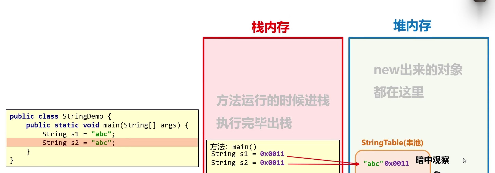
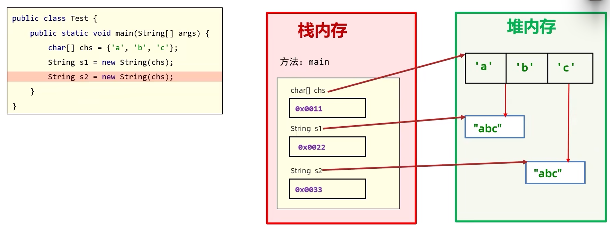
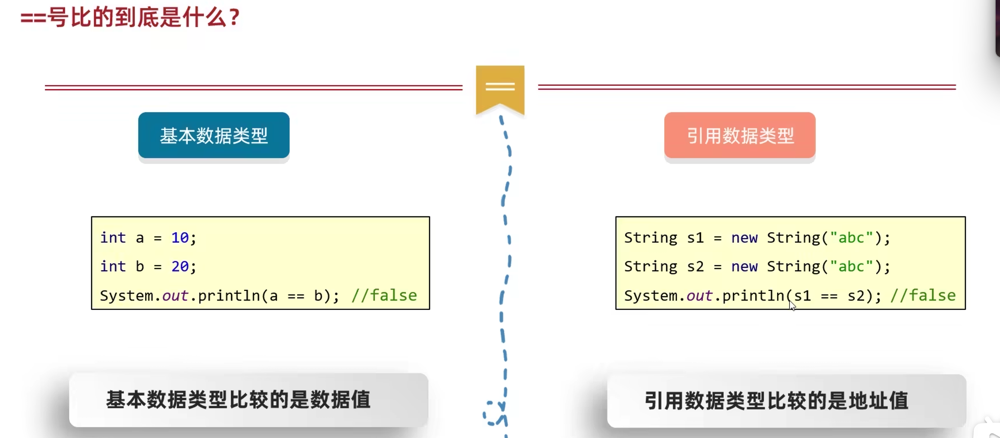

# JAVA NOTES（Part 14）
# ==by tasike,2023.8.28==

# API & 字符串

### 一、API(Application Programming Interface)应用程序编程接口

- #### ==Java API==:**指的就是JDK中提供的各种功能的Java类**

- #### ==API帮助文档==：**帮助开发人员更好地使用API和查询API的工具**

**如何使用Java API帮助文档呢？**

- 打开API帮助文档
- 点击显示，并找到索引下面的输入
- 在输入框中输入类名并点击显示
- 查看类所在的包

### 二、字符串
#### 1. **Java所含的包**
- String，StringBuilder，StringJonier，StringBuffer，Pattern，Matcher
#### 2. **String概述**
- java.lang.String类代表字符串，Java程序中的==所有字符串文字==（例如"abc"）都为此类的对象
- 同时由于String是定义在==java.lang包(java的核心包)==下的，所以使用的时候==不需要导包==
#### 3. **String的注意点**
- 字符串不可变，它的值在创建后不能被更改

```java
String name = "tasike";
String schoolname = "handsome_man";
System.out.println(name + schoolname);

//总共创建了三个字符串
```

```java
String name = "tasike";
name = "handsome_man";

//总共创建了两个字符串
```

#### 4. **创建String对象的两种方式**

- 直接赋值

```java
String name = "tasike";
```

- 使用new的构造方法

|          **构造方法**          |             **说明**             |
| :----------------------------: | :------------------------------: |
|        public String()         |   创建空白字符串，不含任何内容   |
| public String(String original) | 根据传入的字符串，创建字符串对象 |
|   public String(char[] chs)    |   根据字符数组，创建字符串对象   |
|   public String(byte[] chs)    |   根据字节数组，创建字符串对象   |

```java
public class Test{
    public static void main(String[] args){
        // 1.直接赋值
        String s1 = "tasike";
        System.out.println(s1);
        
        // 2.使用new的方法来获取字符串
        // 空参构造,获取一个空的字符串对象
        String s2 = new String();
        System.out.println("a" + s2 + "b");
        
        // 传递一个字符串，根据传递的字符串内容再创建一个新的字符串对象
        String s3 = new String("abc");
        System.out.println(s3);
        
        // 传递一个字符数组，根据字符数组的内容再创建一个新的字符串对象
        // 如果有需求要修改字符串的内容，如把abcd修改成qbcd，则需要利用字符数组来实现
        char[] chs1 = {'a','b','c','d'};
        String s4 = new String(chs1);
        System.out.println(s4);
        
        // 传递一个字节数组，根据字节数组的内容再创建一个新的字符串对象
        byte[] bytes = {97,98,99,100};
        String s5 = new String(bytes);
        System.out.println(s5);  // 发现打印出来的是abcd
    }
}
```

#### 5. **内存模式**

- 当使用双引号直接赋值时，系统会检查该字符串在串池中是否存在
  - 若不存在：创建新的
  - 若存在：复用



- 使用new方法创建的字符串



#### 6. **字符串的常用方法**

- 比较

对于比较，之前学过的==其实有时候是有问题的,如下：

```java
String s1 = "abc";
String s2 = "abc";
System.out.println(s1 == s2);
// true

String s3 = "abc";
String s4 = "def";
System.out.println(s3 == s4);
// false

String s5 = "abc";
String s6 = new String("abc");
System.out.println(s5 == s6);
// false
```

对于第三种，显然是不对的，因此，需要搞清楚====比的到底是什么==



**统一一点来理解，==号比较的是栈里存的值**

可以利用下面的字符串比较方法：

```java
s1.equals(s2);
//返回值为boolean类型，s1和s2完全一样时为true，否则为false

s1.equalsIgnoreCase(s2);
//返回值为boolean类型，与上面的equals方法相比，该方法忽略大小写
```

